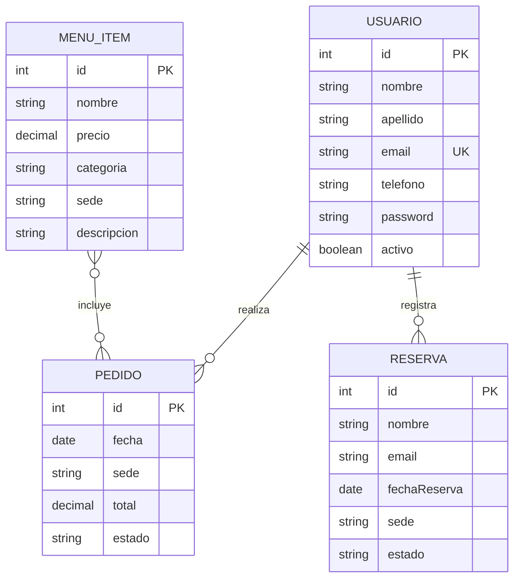

# Backend Tasty Uleam

API REST desarrollada con NestJS para administrar el menú de Tasty Uleam. El recurso principal de esta etapa es `MenuItem`, persistido en PostgreSQL mediante TypeORM.

## 1. Definición del proyecto

Tasty Uleam centraliza la oferta de alimentos de sus sedes universitarias. La API permite administrar los productos del menú y conservarlos aunque la aplicación se reinicie.

### Usuarios previstos

- Clientes que consultan productos y sedes.
- Personal administrador que gestiona el menú.
- Equipo del proyecto que ampliará posteriormente pedidos y reservas.

### Entidades previstas



En esta etapa están implementadas las entidades `Usuario` y `MenuItem`. `Pedido` y `Reserva` quedan como parte de la evolución prevista.

## 2. Arquitectura NestJS

Cada recurso se organiza en módulo, controlador, servicio, DTO y entidad cuando corresponde:

```text
src/
├── menu/
│   ├── dto/
│   ├── entities/
│   ├── menu.controller.ts
│   ├── menu.module.ts
│   └── menu.service.ts
├── usuarios/
│   ├── dto/
│   ├── entities/
│   ├── usuarios.controller.ts
│   ├── usuarios.module.ts
│   └── usuarios.service.ts
├── pedidos/pedidos.module.ts
└── reservas/reservas.module.ts
```

Los controladores reciben las peticiones HTTP y delegan validación, reglas y persistencia a los servicios.

## Instalación

Requisitos: Node.js 18 o superior y PostgreSQL.

```bash
npm ci
```

Copia el archivo de variables:

```bash
copy .env.example .env
```

Configura `.env` con valores locales:

```env
DB_HOST=localhost
DB_PORT=5432
DB_USERNAME=postgres
DB_PASSWORD=tu_clave_local
DB_NAME=tasty_uleam
```

No publiques `.env` ni credenciales reales.

## Ejecución

```bash
npm run start:dev
```

La API inicia en `http://localhost:3000`.

## Validación y errores

La aplicación activa `ValidationPipe` global con:

- `transform: true`
- `whitelist: true`
- `forbidNonWhitelisted: true`

Los servicios devuelven `404 Not Found` cuando no encuentran un registro y `400 Bad Request` ante datos inválidos. El correo duplicado de usuario devuelve `409 Conflict`.

## Endpoints de menú

| Método | Ruta | Descripción |
| --- | --- | --- |
| GET | `/menu` | Lista todos los productos |
| GET | `/menu/:id` | Consulta un producto |
| POST | `/menu` | Crea un producto |
| PATCH | `/menu/:id` | Actualiza parcialmente un producto |
| DELETE | `/menu/:id` | Elimina un producto |

### Ejemplo de creación

```http
POST http://localhost:3000/menu
Content-Type: application/json
```

```json
{
  "nombre": "Hamburguesa Tasty",
  "precio": 5.99,
  "categoria": "Hamburguesas",
  "sede": "Manta",
  "descripcion": "Hamburguesa con carne, queso y vegetales",
  "ingredientes": "Carne, queso, lechuga y tomate",
  "imagen": "hamburguesa.jpg"
}
```

## Endpoints de usuarios

| Método | Ruta | Descripción |
| --- | --- | --- |
| POST | `/usuarios` | Registra un usuario |
| POST | `/usuarios/login` | Valida email y contraseña |
| GET | `/usuarios` | Lista usuarios |
| GET | `/usuarios/:id` | Consulta un usuario |
| PATCH | `/usuarios/:id` | Actualiza parcialmente un usuario |
| DELETE | `/usuarios/:id` | Elimina un usuario |

Las contraseñas se almacenan con `bcryptjs` y no se incluyen en las respuestas. Esta etapa no exige tokens JWT.

## Pruebas

```bash
npm run build
npm test -- --runInBand
```

La suite actual comprueba la creación de los componentes principales. Las pruebas manuales del CRUD seran ejecutadas con Thunder Client

### Checklist de evidencia manual

- [ ] `POST /menu` devuelve `201` y crea un registro.
- [ ] `GET /menu` devuelve la colección.
- [ ] `GET /menu/:id` devuelve el registro solicitado.
- [ ] `PATCH /menu/:id` conserva los campos no enviados.
- [ ] `DELETE /menu/:id` elimina el registro.
- [ ] Un JSON inválido devuelve `400`.
- [ ] Un identificador inexistente devuelve `404`.
- [ ] El registro permanece después de reiniciar la API.
- [ ] pgAdmin muestra las tablas `public.menu_items` y `public.usuarios`.
