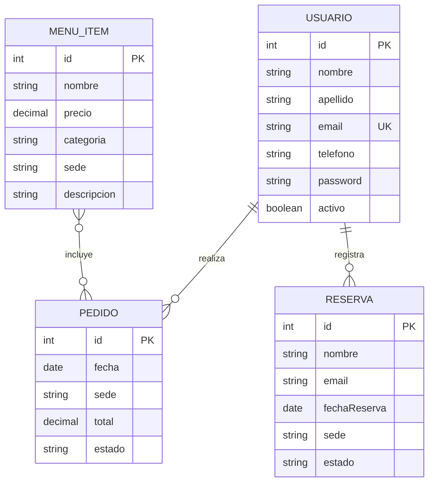

# Backend Tasty Uleam

API REST desarrollada con NestJS para administrar el menú, usuarios, pedidos y reservas de Tasty Uleam. Los recursos `MenuItem`, `Usuario`, `Pedido` y `Reserva` se persisten en PostgreSQL mediante TypeORM.

## 1. Definición del proyecto

Tasty Uleam centraliza la oferta de alimentos de sus sedes universitarias. La API permite administrar los productos del menú, los usuarios, los pedidos que realizan y las reservas que registran, conservando todo aunque la aplicación se reinicie.

### Usuarios previstos

- Clientes que consultan productos, sedes, realizan pedidos y hacen reservas.
- Personal administrador que gestiona el menú.
- Equipo del proyecto que conectará esta API con el frontend.

### Entidades


```mermaid
erDiagram
    USUARIO {
        int id PK
        string nombre
        string apellido
        string email UK
        string telefono
        string password
        boolean activo
    }
    MENU_ITEM {
        int id PK
        string nombre
        decimal precio
        string categoria
        string sede
        string descripcion
    }
    PEDIDO {
        int id PK
        date fecha
        string sede
        decimal total
        string estado
    }
    RESERVA {
        int id PK
        string nombre
        string email
        date fechaReserva
        string sede
        string estado
    }
    USUARIO ||--o{ PEDIDO : realiza
    MENU_ITEM }o--o{ PEDIDO : incluye
    USUARIO ||--o{ RESERVA : registra
```

En esta etapa están implementadas las cuatro entidades: `Usuario`, `MenuItem`, `Pedido` y `Reserva`, con sus relaciones (un pedido pertenece a un usuario e incluye varios productos del menú; una reserva puede asociarse opcionalmente a un usuario registrado).

## 2. Arquitectura NestJS

Cada recurso se organiza en módulo, controlador, servicio, DTO y entidad:

```text
src/
├── menu/
│   ├── dto/
│   ├── entities/
│   ├── menu.controller.ts
│   ├── menu.module.ts
│   └── menu.service.ts
├── usuarios/
│   ├── dto/
│   ├── entities/
│   ├── usuarios.controller.ts
│   ├── usuarios.module.ts
│   └── usuarios.service.ts
├── pedidos/
│   ├── dto/
│   ├── entities/
│   ├── pedidos.controller.ts
│   ├── pedidos.module.ts
│   └── pedidos.service.ts
└── reservas/
    ├── dto/
    ├── entities/
    ├── reservas.controller.ts
    ├── reservas.module.ts
    └── reservas.service.ts
```

Los controladores reciben las peticiones HTTP y delegan validación, reglas y persistencia a los servicios.

## Instalación

Requisitos: Node.js 18 o superior y PostgreSQL.

```bash
npm ci
```

Copia el archivo de variables:

```bash
copy .env.example .env
```

Configura `.env` con valores locales:

```env
DB_HOST=localhost
DB_PORT=5432
DB_USERNAME=postgres
DB_PASSWORD=tu_clave_local
DB_NAME=tasty_uleam
```

No publiques `.env` ni credenciales reales.

## Ejecución

```bash
npm run start:dev
```

La API inicia en `http://localhost:3000`.

## Validación y errores

La aplicación activa `ValidationPipe` global con:

- `transform: true`
- `whitelist: true`
- `forbidNonWhitelisted: true`

Los servicios devuelven `404 Not Found` cuando no encuentran un registro y `400 Bad Request` ante datos inválidos. El correo duplicado de usuario devuelve `409 Conflict`.

## Endpoints de menú

| Método | Ruta | Descripción |
| --- | --- | --- |
| GET | `/menu` | Lista todos los productos |
| GET | `/menu/:id` | Consulta un producto |
| POST | `/menu` | Crea un producto |
| PATCH | `/menu/:id` | Actualiza parcialmente un producto |
| DELETE | `/menu/:id` | Elimina un producto |

### Ejemplo de creación

```http
POST http://localhost:3000/menu
Content-Type: application/json
```

```json
{
  "nombre": "Hamburguesa Tasty",
  "precio": 5.99,
  "categoria": "Hamburguesas",
  "sede": "Manta",
  "descripcion": "Hamburguesa con carne, queso y vegetales",
  "ingredientes": "Carne, queso, lechuga y tomate",
  "imagen": "hamburguesa.jpg"
}
```

## Endpoints de usuarios

| Método | Ruta | Descripción |
| --- | --- | --- |
| POST | `/usuarios` | Registra un usuario |
| POST | `/usuarios/login` | Valida email y contraseña |
| GET | `/usuarios` | Lista usuarios |
| GET | `/usuarios/:id` | Consulta un usuario |
| PATCH | `/usuarios/:id` | Actualiza parcialmente un usuario |
| DELETE | `/usuarios/:id` | Elimina un usuario |

Las contraseñas se almacenan con `bcryptjs` y no se incluyen en las respuestas. Esta etapa no exige tokens JWT.

## Endpoints de pedidos

| Método | Ruta | Descripción |
| --- | --- | --- |
| POST | `/pedidos` | Crea un pedido (calcula el total según los productos incluidos) |
| GET | `/pedidos` | Lista todos los pedidos |
| GET | `/pedidos/:id` | Consulta un pedido |
| PATCH | `/pedidos/:id` | Actualiza parcialmente un pedido |
| DELETE | `/pedidos/:id` | Elimina un pedido |

El campo `total` se calcula automáticamente sumando el precio de los `itemIds` enviados; no se envía manualmente. El `estado` por defecto es `pendiente` y admite: `pendiente`, `en preparacion`, `listo`, `entregado`, `cancelado`.

### Ejemplo de creación

```http
POST http://localhost:3000/pedidos
Content-Type: application/json
```

```json
{
  "usuarioId": 1,
  "sede": "Manta",
  "itemIds": [1, 2]
}
```

## Endpoints de reservas

| Método | Ruta | Descripción |
| --- | --- | --- |
| POST | `/reservas` | Crea una reserva |
| GET | `/reservas` | Lista todas las reservas |
| GET | `/reservas/:id` | Consulta una reserva |
| PATCH | `/reservas/:id` | Actualiza parcialmente una reserva |
| DELETE | `/reservas/:id` | Elimina una reserva |

El campo `usuarioId` es opcional, para permitir reservas de personas no registradas. El `estado` por defecto es `pendiente` y admite: `pendiente`, `confirmada`, `cancelada`.

### Ejemplo de creación

```http
POST http://localhost:3000/reservas
Content-Type: application/json
```

```json
{
  "nombre": "Karla",
  "email": "karla@ejemplo.com",
  "fechaReserva": "2026-10-05",
  "sede": "Manta"
}
```

## Pruebas

```bash
npm run build
npm test -- --runInBand
```

La suite actual comprueba la creación de los componentes principales de los cuatro módulos. Las pruebas manuales del CRUD se ejecutan con Thunder Client.

### Checklist de evidencia manual

- [ ] `POST /menu` devuelve `201` y crea un registro.
- [ ] `GET /menu` devuelve la colección.
- [ ] `GET /menu/:id` devuelve el registro solicitado.
- [ ] `PATCH /menu/:id` conserva los campos no enviados.
- [ ] `DELETE /menu/:id` elimina el registro.
- [ ] Un JSON inválido devuelve `400`.
- [ ] Un identificador inexistente devuelve `404`.
- [ ] El registro permanece después de reiniciar la API.
- [ ] `POST /pedidos` calcula el total y crea el registro con `201`.
- [ ] `POST /reservas` crea el registro con `201` y `estado` en `pendiente`.
- [ ] pgAdmin muestra las tablas `public.menu_items`, `public.usuarios`, `public.pedidos` y `public.reservas`.